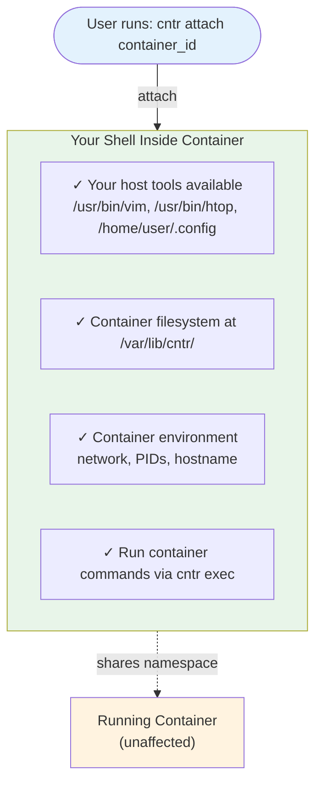

# cntr

Say no to `$ apt install vim` in containers!
`cntr` is a replacement for `docker exec` that brings all your developers tools with you.
This is done by mounting the file system from one container or the host into the target container
by creating a nested container with the help of the Linux mount API.
This allows to ship minimal runtime image in production and limit the surface for exploits.

**Requirements**: Linux kernel 5.2 or later (uses fsopen/fsmount mount API, added in 5.2).

Cntr was also published in [Usenix ATC 2018](https://www.usenix.org/conference/atc18/presentation/thalheim).
See [bibtex](#bibtex) for citation.

**Note:** The academic paper describes the original FUSE-based architecture.
As of version 2.0.0, cntr has been rewritten to use the Linux mount API instead of FUSE,
significantly improving performance and security while maintaining the same user interface and capabilities.

## What you get



**What this means for you:**
- Use your familiar tools (vim, gdb, strace) even if they're not in the container
- Access container files at `/var/lib/cntr/etc/`, `/var/lib/cntr/var/`, etc.
- Same network, process tree, and environment as the container
- Original container keeps running normally - your changes only affect your session
- Run native container commands with `cntr exec`

## Demo

In this two minute recording you learn all the basics of cntr:

[](https://asciinema.org/a/PQB5RnRGLIPn88a1R2MtPccdy)

## Features

- For convenience cntr supports container names/identifier for the following container engines natively:
  * docker
  * podman
  * LXC
  * LXD
  * systemd-nspawn
  * containerd
  * k3s (via containerd/crictl)
- For other container engines cntr also takes process ids (PIDs) instead of container names.

## Installation

Cntr by design is only able to run on Linux.

**System Requirements:**
- Linux kernel 5.2 or later

### Pre-build static-linked binary

For linux x86_64 we build static binaries for every release. More platforms can added on request.
See the [release tab](https://github.com/Mic92/cntr/releases/) for pre-build tarballs.
At runtime only commandline utils of the container engine in questions are required.

### Build from source

All you need for compilation is rust + cargo.
Checkout [rustup.rs](https://rustup.rs/) on how to get a working rust toolchain.
Then run:

Either:

```console
$ cargo install cntr
```

Or the latest master:

```console
$ cargo install --git https://github.com/Mic92/cntr
```

For offline builds we also provided a tarball with all dependencies bundled
[here](https://github.com/Mic92/cntr/releases) for compilation with
[cargo-vendor](https://github.com/alexcrichton/cargo-vendor).

## Usage

At a high-level cntr provides two subcommands: `attach` and `exec`:

- `attach`: Allows you to attach to a container with your own native shell/commands.
  Cntr will mount the container at `/var/lib/cntr` (configurable via `CNTR_BASE_DIR` environment variable).
  The container itself will run unaffected as the mount changes are not visible to container processes.
  - Example: `cntr attach <container_id>` where `container_id` can be a
    container identifier or process id (see examples below).
- `exec`: Run commands from the container filesystem.
  - Usage: `cntr exec <container_id> -- <command>`
  - Example: `cntr exec <container_id>` where `container_id` can be a container identifier or process id
  Since container commands might need their native mount layout at `/`,
  `exec` chroots to the container and sets up the container's environment.

**Note**: Cntr needs to run on the same host as the container. It does not work
if the container is running in a virtual machine while cntr is running on the
hypervisor.

```console
$ cntr --help
cntr 1.6.1
by Jörg Thalheim <joerg@thalheim.io>

Enter or execute in container

USAGE:
    cntr <SUBCOMMAND>

SUBCOMMANDS:
    attach    Enter container with mount overlay
    exec      Execute command in container
    help      Print help
    version   Print version
```

```console
$ cntr attach --help
cntr-attach 1.6.1
by Jörg Thalheim <joerg@thalheim.io>

USAGE:
    cntr attach [OPTIONS] <CONTAINER_ID> [-- <COMMAND>...]

ARGS:
    <CONTAINER_ID>    Container ID, name, or process ID

OPTIONS:
    -t, --type <TYPES>           Container types to try (comma-separated)
                                 [possible: process-id,podman,docker,nspawn,lxc,lxd,containerd,command,kubernetes]
                                 [default: all but command]
    --effective-user <USER>      Effective username for new files on host
    --apparmor <MODE>            AppArmor profile mode
                                 [possible: auto, off]
                                 [default: auto]
    -h, --help                   Print help
    -V, --version                Print version

COMMAND:
    Command and arguments to execute [default: $SHELL]
    Use '--' to separate command from options
```

```console
$ cntr exec --help
cntr-exec 1.6.1
by Jörg Thalheim <joerg@thalheim.io>

USAGE:
    cntr exec [OPTIONS] <CONTAINER_ID> [-- <COMMAND>...]

ARGS:
    <CONTAINER_ID>    Container ID, name, or process ID (required)

OPTIONS:
    -t, --type <TYPES>           Container types to try (comma-separated)
                                 [possible: process-id,podman,docker,nspawn,lxc,lxd,containerd,command,kubernetes]
                                 [default: all but command]
    --apparmor <MODE>            AppArmor profile mode
                                 [possible: auto, off]
                                 [default: auto]
    -h, --help                   Print help
    -V, --version                Print version

COMMAND:
    Command and arguments to execute [default: /bin/sh]
    Use '--' to separate command from options
```

### Docker

1: Find out the container name/container id:
```console
$ docker run --name boxbusy -ti busybox
$ docker ps
CONTAINER ID        IMAGE               COMMAND             CREATED             STATUS              PORTS               NAMES
55a93d71b53b        busybox             "sh"                22 seconds ago      Up 20 seconds                           boxbusy
```

Either provide a container id...

```console
$ cntr attach 55a93d71b53b
[root@55a93d71b53b:/var/lib/cntr]# echo "I am in a container!"
[root@55a93d71b53b:/var/lib/cntr]# ip addr
1: lo: <LOOPBACK,UP,LOWER_UP> mtu 65536 qdisc noqueue state UNKNOWN group default qlen 1000
    link/loopback 00:00:00:00:00:00 brd 00:00:00:00:00:00
    inet 127.0.0.1/8 scope host lo
       valid_lft forever preferred_lft forever
40: eth0@if41: <BROADCAST,MULTICAST,UP,LOWER_UP> mtu 1500 qdisc noqueue state UP group default
    link/ether 02:42:ac:11:00:02 brd ff:ff:ff:ff:ff:ff link-netnsid 0
    inet 172.17.0.2/16 brd 172.17.255.255 scope global eth0
       valid_lft forever preferred_lft forever
[root@55a93d71b53b:/var/lib/cntr]# vim etc/resolv.conf
```

...or the container name.

To execute container native commands, use `cntr exec`:

```console
$ cntr exec boxbusy -- sh -c 'busybox | head -1'
```

You can also use Dockerfile from this repo to build a docker container with cntr:

``` console
$ docker build -f Dockerfile . -t cntr
# boxbusy here is the name of the target container to attach to
$ docker run --pid=host --privileged=true -v /var/run/docker.sock:/var/run/docker.sock -ti --rm cntr attach boxbusy /bin/sh
```

### Podman

See docker usage, just replace `docker` with the `podman` command.


### LXD

1: Create a container and start it

```console
$ lxc image import images:/alpine/edge
$ lxc launch images:alpine/edge
$ lxc list
+-----------------+---------+------+------+------------+-----------+
|      NAME       |  STATE  | IPV4 | IPV6 |    TYPE    | SNAPSHOTS |
+-----------------+---------+------+------+------------+-----------+
| amazed-sailfish | RUNNING |      |      | PERSISTENT | 0         |
+-----------------+---------+------+------+------------+-----------+
```

2: Attach to the container with cntr

```console
$ cntr attach amazed-sailfish
$ cat etc/hostname
amazed-sailfish
```

### LXC

1: Create a container and start it

```console
$ lxc-create --name ubuntu -t download -- -d ubuntu -r xenial -a amd64
$ lxc-start --name ubuntu -F
...
Ubuntu 16.04.4 LTS ubuntu console
ubuntu login:
$ lxc-ls
ubuntu
```

2: Attach to container with cntr:

```console
$ cntr attach ubuntu
[root@ubuntu2:/var/lib/cntr]# cat etc/os-release
NAME="Ubuntu"
VERSION="16.04.4 LTS (Xenial Xerus)"
ID=ubuntu
ID_LIKE=debian
PRETTY_NAME="Ubuntu 16.04.4 LTS"
VERSION_ID="16.04"
HOME_URL="http://www.ubuntu.com/"
SUPPORT_URL="http://help.ubuntu.com/"
BUG_REPORT_URL="http://bugs.launchpad.net/ubuntu/"
VERSION_CODENAME=xenial
UBUNTU_CODENAME=xenial
```

### systemd-nspawn

1: Start container

```console
$ wget https://cloud-images.ubuntu.com/releases/16.04/release/ubuntu-16.04-server-cloudimg-amd64-root.tar.xz
$ mkdir /var/lib/machines/ubuntu
$ tar -xf ubuntu-16.04-server-cloudimg-amd64-root.tar.xz -C /var/lib/machines/ubuntu
$ systemd-nspawn -b -M ubuntu
$ machinectl list
MACHINE CLASS     SERVICE        OS     VERSION ADDRESSES
ubuntu  container systemd-nspawn ubuntu 16.04   -
```

2: Attach
```console
$ cntr attach ubuntu
```

### Generic process id

The minimal information needed by cntr is the process id of a container process you want to attach to.

```console
# Did you now chromium uses namespaces too?
$ ps aux | grep 'chromium --type=renderer'
joerg    17498 11.7  1.0 1394504 174256 ?      Sl   15:16   0:08 /usr/bin/chromium
```

In this case 17498 is the pid we are looking for.

```console
$ cntr attach 17498
# looks quite similar to our system, but with less users
[joerg@turingmachine cntr]$ ls -la /
total 240
drwxr-xr-x   23 nobody nogroup    23 Mar 13 15:05 .
drwxr-xr-x   23 nobody nogroup    23 Mar 13 15:05 ..
drwxr-xr-x    2 nobody nogroup     3 Mar 13 15:14 bin
drwxr-xr-x    4 nobody nogroup 16384 Jan  1  1970 boot
drwxr-xr-x   24 nobody nogroup  4120 Mar 13 14:56 dev
drwxr-xr-x   52 nobody nogroup   125 Mar 13 15:14 etc
drwxr-xr-x    3 nobody nogroup     3 Jan  8 16:17 home
drwxr-xr-x    8 nobody nogroup     8 Feb  9 22:10 mnt
dr-xr-xr-x  306 nobody nogroup     0 Mar 13 09:38 proc
drwx------   22 nobody nogroup    43 Mar 13 15:09 root
...
```

### Containerd

For containerd integration the `ctr` binary is required. You can get a binary by running:

``` console
$ GOPATH=$(mktemp -d)
$ go get github.com/containerd/containerd/cmd/ctr
$ $GOPATH/bin/ctr --help
```

Put the resulting `ctr` binary in your `$PATH`

1: Start container
```console
$ ctr images pull docker.io/library/busybox:latest
$ ctr run docker.io/library/busybox:latest boxbusy
$ ctr tasks lists
TASK        PID      STATUS
boxbusy    24310    RUNNING
```

2: Attach
```console
$ cntr attach boxbusy
```

It's also possible to run cntr from a container itself.
This repository contains a example Dockerfile for that:

```console
$ docker build -f Dockerfile.example . -t cntr
$ docker save cntr > cntr.tar
$ ctr images import --base-name cntr ./cntr.tar
```

In this example we attach to containerd by process id. The process id of a task is given in `ctr tasks list`.

```console
$ ctr run --privileged --with-ns pid:/proc/1/ns/pid --tty docker.io/library/cntr:latest cntr /usr/bin/cntr attach 31523 /bin/sh
```

To resolve containerd names one also would need to add the `ctr` binary (~12mb) to the Dockerfile.

## Additional Config

### Custom Mount Directory

By default, cntr mounts containers at `/var/lib/cntr`. You can customize this location using the `CNTR_BASE_DIR` environment variable:

```console
$ export CNTR_BASE_DIR=/custom/path
$ cntr attach mycontainer
[root@container:/custom/path]#
```

This is particularly useful for:
- Testing with temporary directories
- Systems where `/var/lib/cntr` is not suitable
- Isolating multiple cntr sessions

### AppArmor Profile Control

By default, cntr automatically inherits the AppArmor security profile from the target container. You can control this behavior using the `--apparmor` flag:

```console
# Default behavior - automatically inherit AppArmor profile
$ cntr attach mycontainer

# Explicitly enable AppArmor profile inheritance
$ cntr attach --apparmor auto mycontainer

# Disable AppArmor profile inheritance
$ cntr attach --apparmor off mycontainer
$ cntr exec --apparmor off mycontainer -- /bin/sh
```

**When to use `--apparmor off`:**
- Troubleshooting AppArmor-related issues
- Running tools that conflict with the container's AppArmor profile
- Systems where AppArmor is not properly configured
- Development and debugging scenarios where you need unrestricted access

**Note:** On systems without AppArmor enabled, this flag has no effect. The flag is available for both `attach` and `exec` commands.

### Running with File Capabilities (setcap)

By default, cntr requires root privileges. However, you can use Linux file capabilities
to run cntr without full root access:

```console
# Grant required capabilities to cntr binary
$ sudo setcap 'cap_sys_admin,cap_sys_chroot=ep' /usr/local/bin/cntr

# Enable setcap mode (required due to Linux security restrictions)
$ export CNTR_ALLOW_SETCAP=1

# Now run cntr as a regular user
$ cntr attach mycontainer
```

**Required capabilities:**
| Capability | Purpose |
|------------|---------|
| `CAP_SYS_ADMIN` | Namespace operations (`unshare`, `setns`), mount operations |
| `CAP_SYS_CHROOT` | `chroot()` for `cntr exec` command |
| `CAP_SYS_PTRACE` | Only needed when attaching to containers owned by a different user |

**Why `CNTR_ALLOW_SETCAP=1` is required:**

When Linux runs a binary with file capabilities, it marks the process as "non-dumpable"
for security. This prevents the process from accessing `/proc/self/ns/*`, which cntr
needs to function. Setting `CNTR_ALLOW_SETCAP=1` tells cntr to re-enable dumpable mode
via `prctl(PR_SET_DUMPABLE, 1)`.

**Security considerations:**

Enabling dumpable mode has security implications:
- Core dumps may expose privileged memory contents
- Other processes running as the same user can `ptrace()` the cntr process

The risk is mitigated by cntr's short-lived nature (attach → exec → exit), but you
should understand these tradeoffs before using this feature.

# How it works

Cntr is container-agnostic: Instead of interfacing with container engines, it
implements the underlying operating system API. It treats every container as a
group of processes, that it can inherit properties from.

Cntr inherits the following container properties:
  * Namespaces (mount, uts, pid, net, cgroup, ipc)
  * Cgroups
  * Apparamor/selinux
  * Capabilities
  * User/group ids
  * Environment variables
  * The following files: /etc/passwd, /etc/hostname, /etc/hosts, /etc/resolv.conf

# Related projects
- [nsenter](https://manpages.debian.org/testing/manpages-de/nsenter.1.de.html)
  - Only covers linux namespaces and the user is limited to tools installed in the
    containers
- [toolbox](https://github.com/coreos/toolbox)
  - Does attach from a container to the host, this is the opposite of what Cntr
    is doing

# Bibtex

We published a paper with all technical details about Cntr in
[Usenix ATC 2018](https://www.usenix.org/conference/atc18/presentation/thalheim).

```bibtex
@inproceedings{cntr-atc18,
  author = {J{\"o}rg Thalheim and Pramod Bhatotia and Pedro Fonseca and Baris Kasikci},
  title = {Cntr: Lightweight {OS} Containers},
  booktitle = {2018 {USENIX} Annual Technical Conference ({USENIX} {ATC} 18)},
  year = {2018},
}
```
